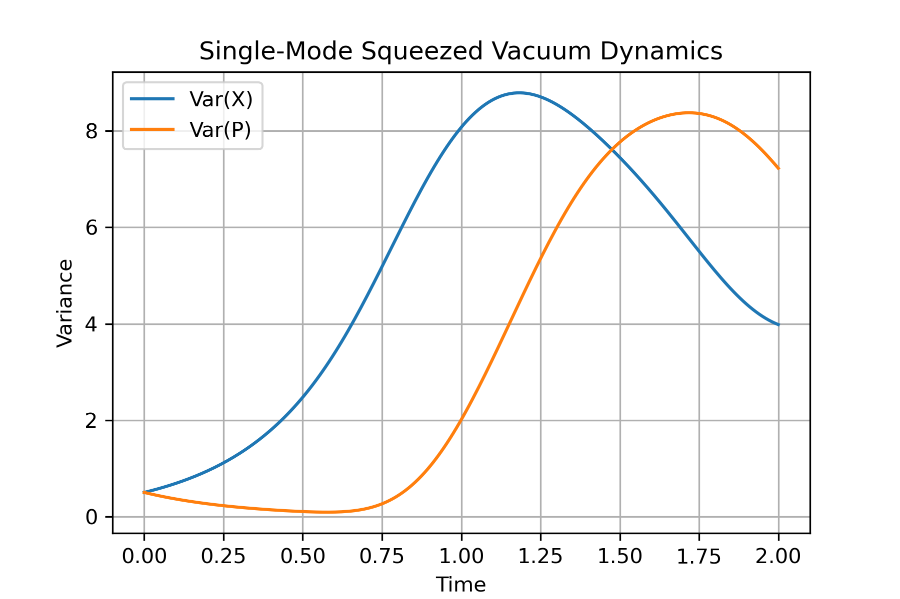
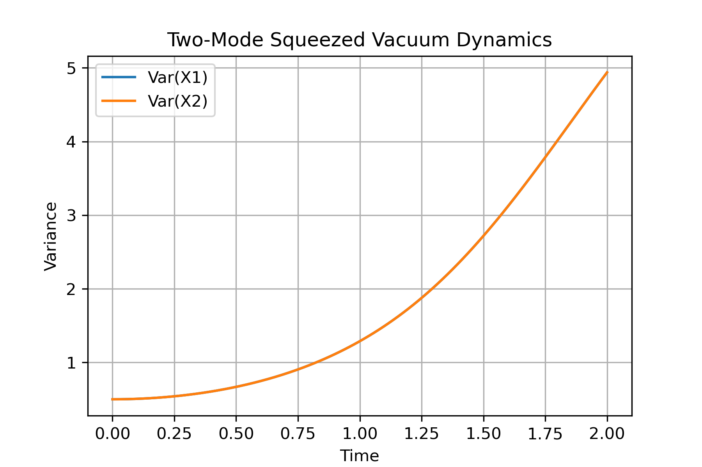
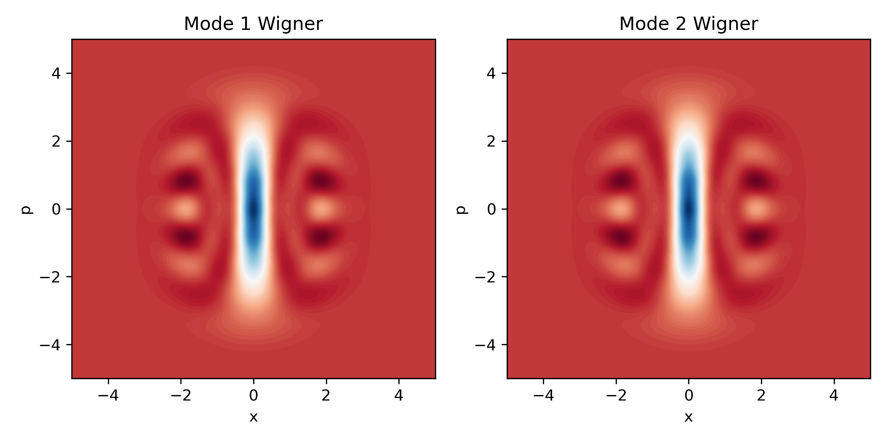

# Prof. Aidelsburger-Inspired CV Quantum Simulation Projects

This repository contains simulations related to continuous-variable (CV) quantum optics, inspired by the research of Prof. Monika Aidelsburger on quantum simulation with ultracold atoms and engineered gauge fields.

## Project 1: Squeezed Vacuum Dynamics

- **Single-Mode:**  
  - **Hamiltonian:** \( H = i r (a^{\dagger\,2} - a^2) \)
  - **Simulation:** Variance of quadratures (X/P) vs. time.
  - **Figure:** 
- **Two-Mode:**  
  - **Hamiltonian:** \( H = i r (a^{\dagger}b^{\dagger} - a b) \)
  - **Simulation:** Variance of quadratures (X₁/X₂) vs. time.
  - **Figure:** 

## Project 2: 2-Mode CV Cluster & Wigner Functions

- **Preparation:**  
  - **State:** Single-mode squeezing \( S(r) \) on each mode, followed by CZ gate \( \exp(i g X_1 X_2) \).
- **Wigner Function:**  
  - **Method:** Computed via QuTiP’s `wigner` function.
  - **Plot:** Wigner function for both modes.
  - **Figure:** 

---

## **Inspired by:**  
Aidelsburger, M., et al. "Artificial gauge fields with ultracold atoms," *Rep. Prog. Phys.* **81**, 064401 (2018).  
[DOI:10.1088/1361-6455/aac120](https://doi.org/10.1088/1361-6455/aac120)

## How to Run
```bash
conda activate qc-env
jupyter lab

