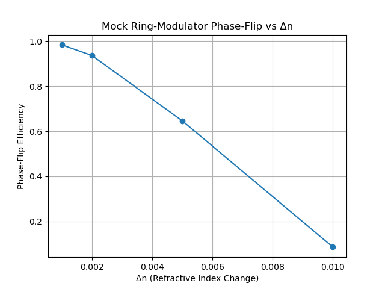

# Project: Microring Modulator Phase‑Flip Demo

Inspired by photonic QEC schemes in hybrid devices :contentReference[oaicite:2]{index=2}:contentReference[oaicite:3]{index=3}, this notebook
demonstrates a simple phase‑flip operation via a tunable microring modulator.

## Objective
To show how a refractive‑index change (Δn) in the ring induces a π phase shift
(|1⟩→–|1⟩) in a dual‑rail encoding.

## Mock Model
We use a sinusoidal proxy:
$$\eta(Δn) = \cos^2\!\bigl(\tfrac{2π·Δn·L}{λ}\bigr),$$
where \(L=2π·R\) is the ring circumference.

## Plot

## To Run
> bash
conda activate qc-env
jupyter lab
