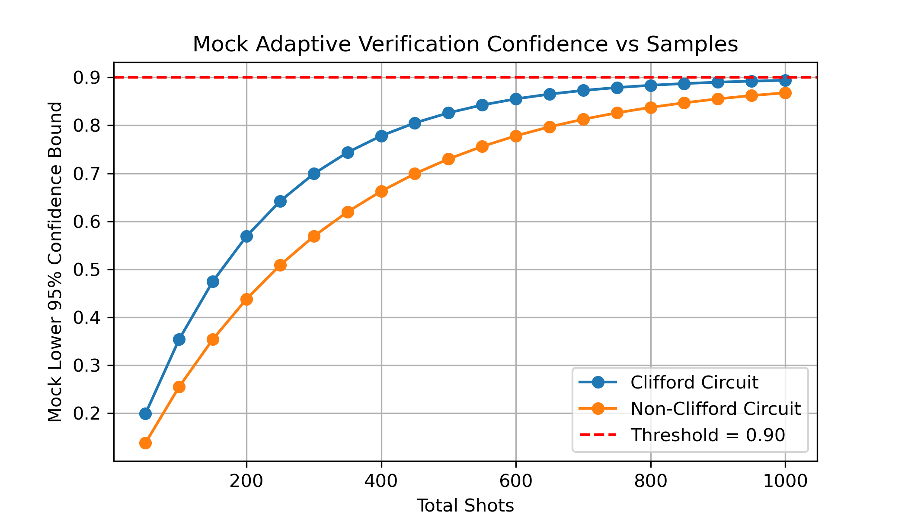

# Adaptive Clifford Circuit Verification Simulation

This simulation demonstrates an adaptive verification protocol for quantum circuits, modeling how confidence bounds tighten with increasing measurement samples.

## Scientific Background

In quantum computing, verifying the fidelity of quantum circuits is essential for ensuring reliable computation. This simulation models a statistical approach where:

- The confidence bound on circuit fidelity follows an exponential approach to the true value
- Adaptive sampling continues until a predefined confidence threshold is reached
- Different circuit types (Clifford vs. Non-Clifford) exhibit distinct convergence behaviors

## Implementation Details

The simulation uses a mock lower bound function that models the Wilson confidence interval:
```python
lb = fidelity * (1 - exp(-shots/decay))
```

Where:
- `fidelity` represents the true circuit fidelity (0.9 in this simulation)
- `decay` controls the convergence rate (200 for Clifford, 300 for Non-Clifford)
- `shots` is the cumulative number of measurement samples

## Parameters

- **Confidence Threshold:** 0.90
- **Sampling Strategy:** 50 shots per iteration
- **Maximum Samples:** 1000 shots (20 iterations)
- **Circuit Types:** Clifford (faster convergence) and Non-Clifford (slower convergence)



## How to Run

```bash
conda activate qc-env
jupyter lab
```