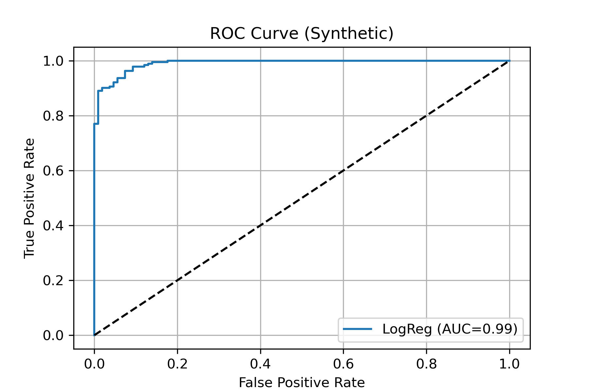
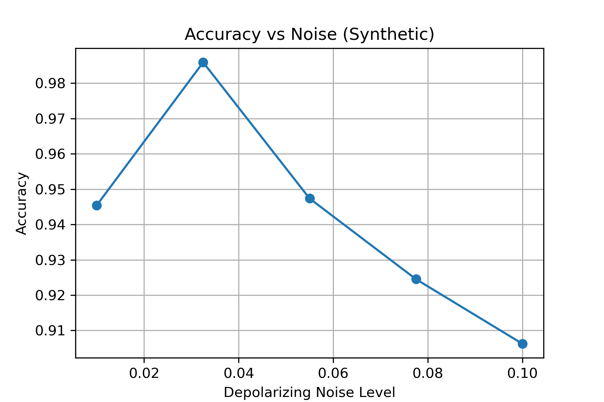

# ML-Enhanced Quantum Circuit Verification

This simulation demonstrates a machine learning approach to quantum circuit verification, using synthetic data to model confidence estimation in circuit fidelity assessment.

## Scientific Background

Quantum circuit verification traditionally requires many measurements to establish confidence bounds. This simulation explores how machine learning can enhance this process by:

- Learning patterns in measurement statistics that correlate with circuit fidelity
- Providing binary classification (pass/fail) based on a fidelity threshold
- Maintaining accuracy even as noise levels increase

## Implementation Details

The simulation uses a synthetic data model where:

1. Circuit fidelity is simulated as inversely related to noise level
2. Measurement outcomes are modeled using Dirichlet distributions:
   ```python
   alpha_other = max((1 - fidelity)*10, 0.1)
   alpha_target = max(fidelity*50, 0.1)
   probs = np.random.dirichlet([alpha_other]*3 + [alpha_target])
   ```
3. A logistic regression classifier is trained to predict whether fidelity exceeds the threshold (0.8)

## Performance Metrics

- **ROC Curve Analysis:** Evaluates the classifier's ability to distinguish high vs. low fidelity circuits
  
  
- **Noise Resilience:** Shows how classification accuracy changes with increasing noise levels
  

## How to Run

```bash
conda activate qc-env
jupyter lab
```