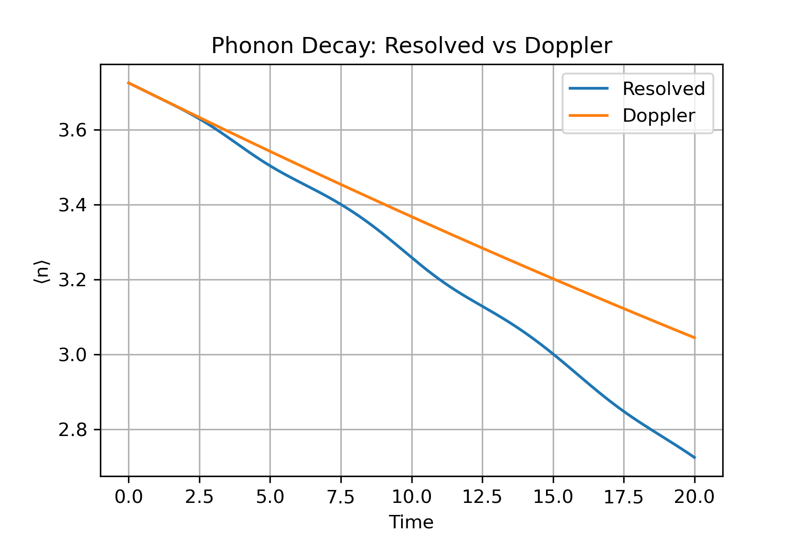
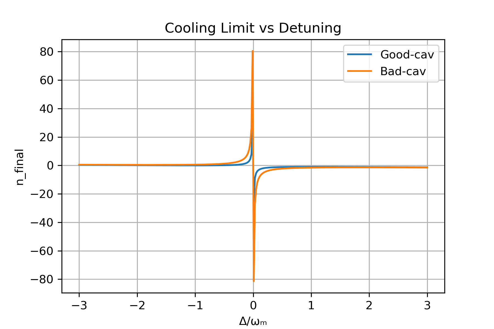
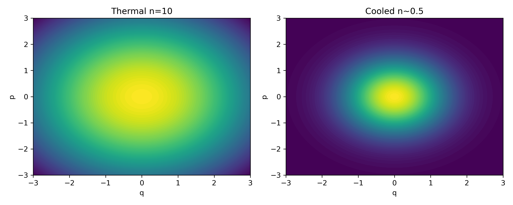

# Marquardt_Optomech

This notebook reproduces core concepts from Prof. Florian Marquardt’s work on sideband cooling of mechanical motion via cavity optomechanics. Both resolved-sideband and Doppler cooling regimes are explored through Lindblad simulations, and the effects of detuning are analyzed quantitatively.

## Project 1: Phonon Decay – Resolved vs Doppler Regimes

Simulates the time evolution of the average phonon number ⟨n⟩ under two different optical damping regimes:

- **Resolved-sideband cooling** (κ ≪ ωₘ)
- **Doppler-like regime** (κ ≫ ωₘ)

**Figure:**  

 

Depicts phonon decay trajectories for each regime using QuTiP's `mesolve`.

---

## Project 2: Cooling Limit vs Detuning + Wigner Comparison

### A. Detuning Sweep

- Scans final phonon number ⟨n⟩ as a function of laser detuning Δ.
- Compares optimal cooling conditions in both regimes.

**Figure:**  



---

### B. Wigner Distributions

- Visualizes phase-space distributions of:
  - Initial thermal state (n ≈ 10)
  - Final cooled state (n ≈ 0.5)

**Figure:**  

  

Generated using Gaussian approximations for clarity.

---

## How to Run

Ensure QuTiP is installed in your conda environment.

```bash
conda activate qc-env
jupyter lab

### Reference

F. Marquardt, J.P. Chen, A.A. Clerk, S.M. Girvin,
“Quantum Theory of Cavity-Assisted Sideband Cooling of Mechanical Motion”,
Phys. Rev. Lett. 99, 093902 (2007)