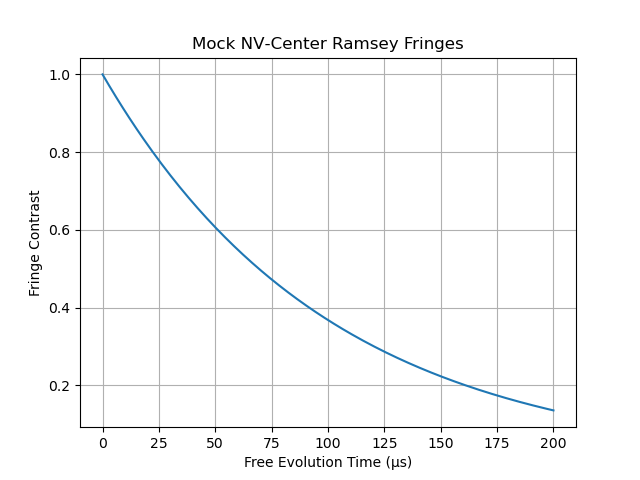

# Project: NV‑Center Ramsey Fringes (Mock)

This demo simulates NV‑center Ramsey sequence fringes with a simple
decay & cosine model:

- Free evolution times: 0–200 µs  
- Decoherence time T₂ = 100 µs (exp decay)  
- Fringe frequency = 1 MHz

Run:

>bash
conda activate qc-env
jupyter lab
open Reinhard_NV_Ramsey.ipynb
