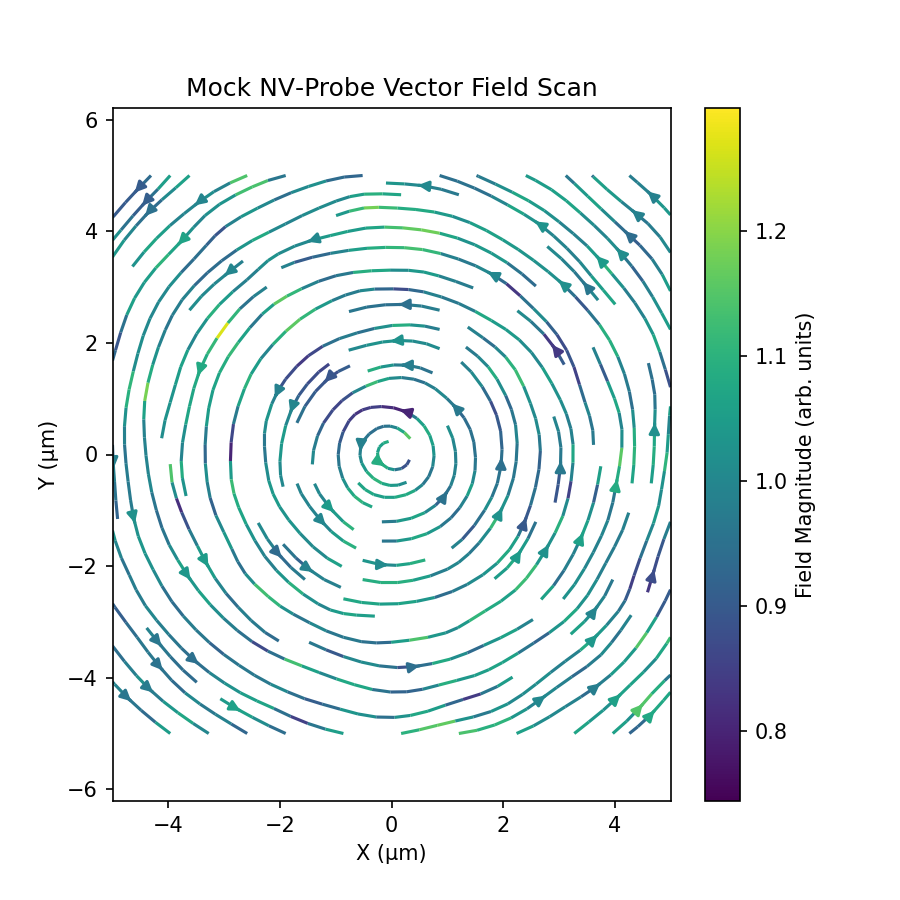

# Vector Field Imaging with NV-Center Probe Simulation

This simulation demonstrates a scanning probe microscopy technique using nitrogen-vacancy (NV) centers to map 2D vector magnetic fields, inspired by methods developed in Reinhard et al. (2024).

## Scientific Background

Nitrogen-vacancy centers in diamond have emerged as powerful quantum sensors for nanoscale magnetic field imaging. This simulation explores:

- Vector magnetometry using NV centers as scanning probes
- Spatial mapping of magnetic field distributions with sub-micron resolution
- Signal-to-noise considerations in quantum sensing applications
- Visualization techniques for vector field data

## Implementation Details

The simulation uses a simplified model to demonstrate the vector field mapping process:

1. Field generation and sampling:
   - Creates a uniform spatial grid spanning ±5 μm
   - Defines a radial vector field pattern: B(x,y) ∝ (-y, x)/r
   - Samples the field at each grid point to simulate a raster scan

2. Measurement simulation:
   - Adds Gaussian noise to field components to model measurement uncertainty
   - Noise amplitude is scaled to represent realistic signal-to-noise ratios
   - Simulates the effect of finite spatial resolution in the scanning probe

3. Visualization:
   - Uses `matplotlib.streamplot` to render the vector field
   - Color mapping indicates field strength
   - Arrow density represents spatial resolution of the measurement

## Performance Metrics

The simulation produces a visualization of the mapped vector field:



Key features shown in the plot:
- Circular field pattern with radial symmetry
- Noise artifacts that would be present in real measurements
- Field strength indicated by color gradient
- Direction information preserved despite measurement noise

## How to Run

```bash
conda activate qc-env
jupyter lab
```