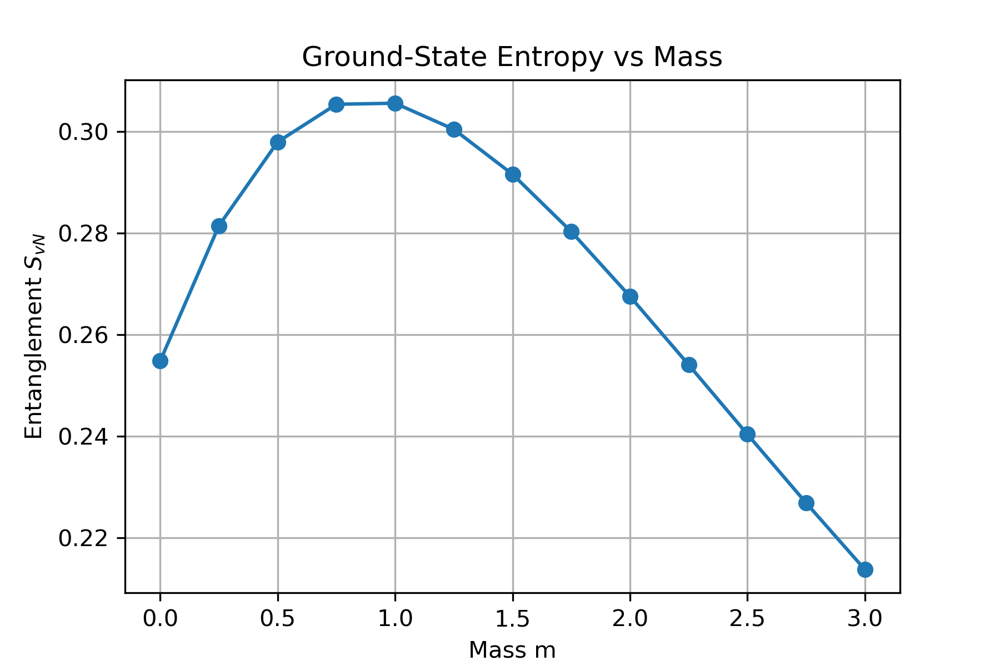
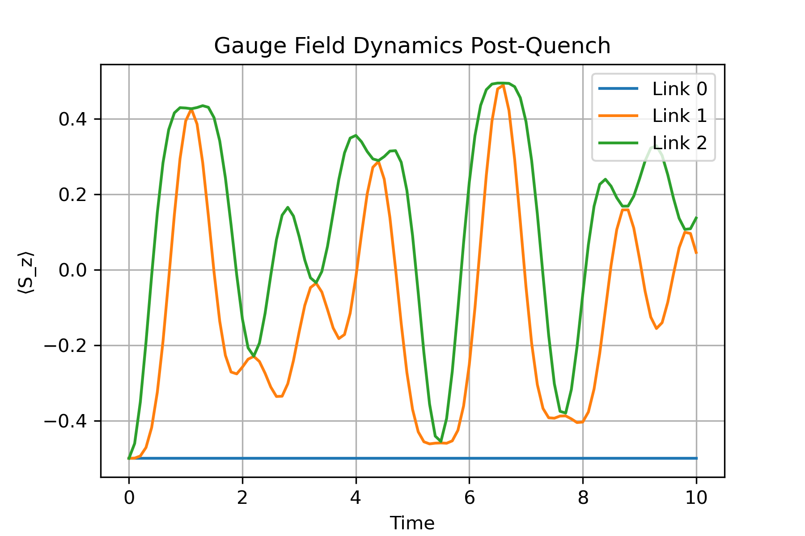

# Schwinger_Model

Demonstrates key (1+1)D lattice Schwinger/QED phenomena via exact diagonalization.

## Project 1: Ground‑State Entanglement vs. Mass
- Builds H(m) for 4 matter sites + 3 links.
- Computes von Neumann entropy of the left half vs. m.
- **Figure:**


## Project 2: String‑Breaking Quench Dynamics
- Prepares end‑charged state, quenches m → 0.5.
- Tracks ⟨n⟩ (matter) and ⟨S_z⟩ (gauge) over time.
- **Figures:**
, 

## Run
```bash
conda activate qc-env
jupyter lab